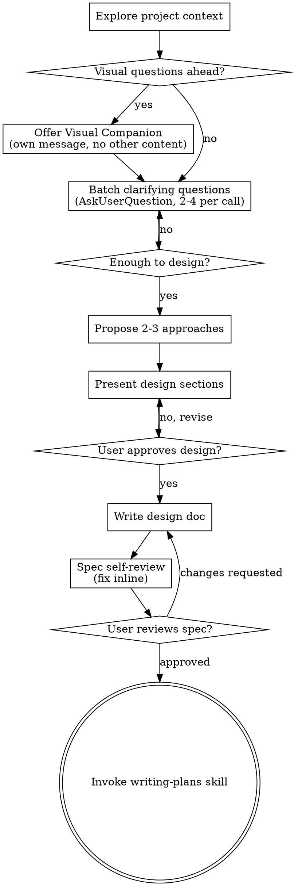

# Brainstorming Ideas Into Designs

助化念為成設計與 spec，經自然協對話。

先明 project 當 context，後批問以精煉念。明所建後，呈設計，取 user 許。

<HARD-GATE>
於呈設計且 user 許前，勿呼任何實作 skill、勿書任何 code、勿 scaffold 任何 project、勿行任何實作之舉。此適於**每** project，無論其似簡。
</HARD-GATE>

## Anti-Pattern: "This Is Too Simple To Need A Design"

每 project 遵此程。To-do 列、單函工具、config 變——皆然。「簡」project 即未察假設生最多廢工之所。設計可短（真簡者數句即可），然汝**必**呈之並取許。

## Checklist

汝必為下每項立 task 並依序竟：

1. **Explore project context** — 察檔、docs、近 commit
2. **Offer visual companion**（若議涉視覺）— 為獨訊，勿合於問。見下 Visual Companion 節。
3. **Ask clarifying questions** — 批 2–4 相關問 per `AskUserQuestion` call；迭至足以設計
4. **Propose 2-3 approaches** — 附權衡與汝薦
5. **Present design** — 按複雜度縮放分節，每節後取許
6. **Write design doc** — 存於 `docs/superpowers/specs/YYYY-MM-DD-<topic>-design.md` 並 commit
7. **Spec self-review** — inline 速察 placeholder、矛盾、模糊、scope（見下）
8. **User reviews written spec** — 請 user 審 spec 檔後再進
9. **Transition to implementation** — 呼 writing-plans skill 以造實作計劃

## Process Flow



**終態即呼 writing-plans。** 勿呼 frontend-design、mcp-builder、或其他實作 skill。Brainstorming 後**唯一**呼之 skill 即 writing-plans。

## Asking Questions with AskUserQuestion

用 `AskUserQuestion` tool 於所有澄清問。Tool 支 1–4 問 per call——**常批盡可能多相關問**以減 round trip。

### Batching Rules

```
ALWAYS batch questions that:
  - Can be answered independently (answers don't depend on each other)
  - Cover different dimensions of the design (scope, style, constraints, deployment)
  - Are all needed before you can make progress

DO NOT batch questions where:
  - Answer to question A determines whether question B is relevant
  - The user's answer to one question would reframe all the others
  - A question is a follow-up to something just said

Target: 2-4 questions per call. A single question is acceptable only when
it's a genuine decision point that gates everything else.
```

### Question Design

每問應有 2–4 structured option 附述。「Other」恆自加——汝不須含之。答空或未全涵時用之。

```
Good question design:
  question: "What's the primary deployment target?"
  options:
    - label: "Container / Kubernetes"      description: "Docker image, orchestrated"
    - label: "Serverless"                  description: "Lambda, Cloud Functions"
    - label: "Desktop app"                 description: "Packaged binary, local only"
    - label: "Edge runtime"                description: "Cloudflare Workers, Deno Deploy"

Good use of multiSelect:
  question: "Which external services does this integrate with?"
  multiSelect: true
  options:
    - label: "Auth provider"     description: "OAuth, Auth0, Clerk"
    - label: "Payment gateway"   description: "Stripe, Paddle"
    - label: "Email service"     description: "SendGrid, Postmark, SES"
    - label: "Storage"           description: "S3, GCS, Cloudflare R2"

Good use of preview (for visual/layout choices):
  question: "Which dashboard layout fits your workflow?"
  options:
    - label: "Sidebar nav"   preview: "┌──┬────────┐\n│  │        │\n│  │        │\n└──┴────────┘"
    - label: "Top nav"       preview: "┌────────────┐\n├────────────┤\n│            │\n└────────────┘"

Bad — open-ended with no options (use free text via Other instead):
  question: "What do you want to build?"   ← ask this as text, not AskUserQuestion
```

### First Question Batch — Standard Opening

多數 project，以此 3–4 問於一 call 開：

```
1. Project/feature scope
   (What is this, at a high level — new feature, bug fix, standalone tool?)

2. Architecture / style preference
   (Simple/flat, CRUD, DDD, event-driven, microservices?)

3. Primary constraint
   (Speed of delivery, maintainability, performance, team size?)

4. Existing codebase?
   (Greenfield, adding to existing project, replacing something?)
```

讀答後，再批 2–4 問於細。通 2 輪批問即足；3 乃極限於呈法前。

### When to Use Free Text

有問無界答集。彼時作純文問（非 `AskUserQuestion`），並於 structured 問旁或後：

- "What are the key domain concepts?" — 無界，以文問
- "Describe the current pain point" — context，以文問
- "Any other constraints I should know?" — 收尾，以文問

## The Process

**明念：**

- 先察當 project 狀（檔、docs、近 commit）
- 問前察 scope：若請述多獨立子系統（例如「建 chat + file storage + billing + analytics 之平台」），立旗。勿耗問於應先分解之 project 之細。
- 若 project 過大，助 user 分子 project：何乃獨片，如何相關，當以何序建？ 後以常設計流 brainstorm 第一子 project。每子 project 有其 spec → plan → impl 環。
- 用 `AskUserQuestion` 於所有 structured 擇。批 2–4 per call。
- 用純文問於無界或 context 者。
- 專注於明：目的、限制、成準

**探法：**

- 呈 2-3 法附權衡
- 對話式呈選，附汝薦與因
- 領以汝薦者並釋何以

**呈設計：**

- 明所建後，呈設計
- 每節按複雜度縮放：簡者數句，細者 200-300 字
- 每節後問觀之宜否
- 涵：架構、組件、資料流、錯處、測
- 備若不合則回澄

**設計為孤立與清晰：**

- 拆系為小單——各一明目、經明介面通、可獨明且測
- 每單，汝當能答：何為，如何用，依何
- 他人可不讀內即明何為否？可改內而不破用者否？ 否則界須重。
- 小而界明之單亦汝易工——汝善推理於可一時持於 context 之碼，編小專檔更可靠。檔漸大乃其作過多之兆。

**於既 codebase：**

- 提變前探當結構。循既式。
- 既碼有疾影工（例如過大之檔、界不清、責糾結）時，將針對性改作計之部——善 dev 改其所工碼之法。
- 勿提無關重構。專於當目標。

## After the Design

**Documentation：**

- 書驗過之設計（spec）於 `docs/superpowers/specs/YYYY-MM-DD-<topic>-design.md`
  - (User preferences for spec location override this default)
- 若有 elements-of-style:writing-clearly-and-concisely skill，用之
- Commit design document 入 git

**Spec Self-Review：**
書 spec 後，以新眼察：

1. **Placeholder scan：** 有「TBD」、「TODO」、缺節、模糊需否？ 修之。
2. **Internal consistency：** 節間矛盾否？ 架構配功述否？
3. **Scope check：** 專注足於單 impl 計劃否，或須分解？
4. **Ambiguity check：** 任何需可兩解否？ 若可，擇一明之。

Inline 修疾。無需再審——修即進。

**User Review Gate：**
Spec review 環過後，請 user 審書成之 spec 再進：

> "Spec written and committed to `<path>`. Please review it and let me know if you want to make any changes before we start writing out the implementation plan."

待 user 答。若請變，作之並再跑 spec review 環。僅於 user 許後進。

**Implementation：**

- 呼 writing-plans skill 以造詳 impl 計劃
- 勿呼他 skill。writing-plans 即下一步。

## Key Principles

- **Batch questions** - 用 `AskUserQuestion` 含 2–4 問 per call；減 round trip
- **Structured options preferred** - 界明時易答
- **YAGNI ruthlessly** - 自所有設計除無謂功
- **Explore alternatives** - 定前常提 2-3 法
- **Incremental validation** - 分節呈設計，取許方進
- **Be flexible** - 不合時回澄

## Visual Companion (mini-IDE)

一 browser-based companion，render Claude 書於 session 目錄之 markdown+YAML screen。替舊 fragment-based companion（已自此 fork 除）。作 tool——非 mode。受 companion 意其可為宜視覺處之問所用；不意每問必經瀏覽器。

**提 companion：** 當汝料下問涉視覺（mockup、layout、diagram）時，提一次以取同意：
> "Some of what we're working on might be easier to explain if I can show it to you in a web browser. I can put together mockups, diagrams, comparisons, and other visuals as we go. Want to try it? (Requires opening a local URL)"

**此提必為獨訊。** 勿合以澄清問、context 摘、或他內容。

### Starting the companion

```bash
bun run skills/brainstorming/companion/packages/server/src/cli.ts start \
  --session-dir /path/to/project/.superpowers/brainstorm/<session> \
  --doc-root /path/to/project/docs \
  --doc-root /path/to/project/specs
```

Server 書 `$SESSION_DIR/server-info` 並列印一 JSON 行含 `{url, port, pid}`。告 user 開 URL。

### Streaming events back into this session

`companion start` 後，每 session 設 Monitor 一次：

```
Monitor(
  description: "brainstorming companion events",
  command:     "tail -n 0 -F $SESSION_DIR/events.jsonl | grep --line-buffered -v '^$'",
  persistent:  true,
  timeout_ms:  3600000
)
```

`events.jsonl` 每 JSON 行即一 notification。靜即免——user 讀時無 token 耗。

### Writing screens

見 `skills/brainstorming/companion/docs/screen-format.md` 以察全參考。三類：`question`、`demo`、`decision`。各為一 markdown 檔，YAML frontmatter 於 `$SESSION_DIR/screens/` 下。

### Privacy

`private: true` 之 input（與所有 `file-edit` input）走獨 save path——直書目標檔並僅 emit `saved` event 附 sha256 digest——內容不經 companion 達 Claude。此**不**防 Claude 以己讀檔 tool 讀同 path；真秘者，`.gitignore` 之且勿請 Claude 讀。
