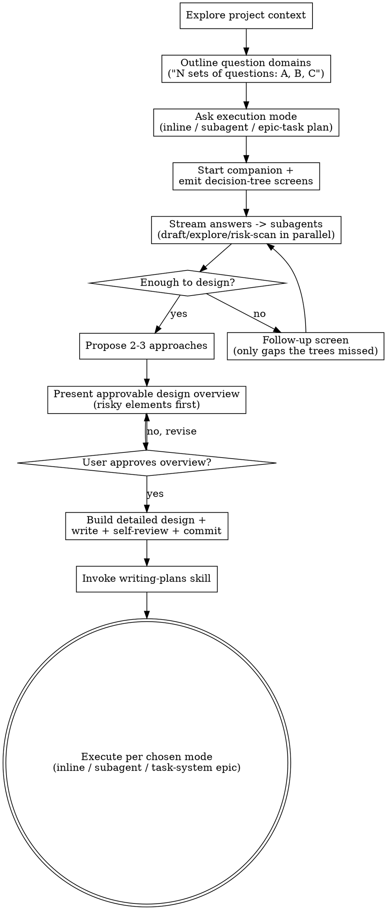

# Brainstorming Ideas Into Designs

助化念為成設計與 spec，經結構化、低往返之協對話。

先明 project 當 context。次**揭問域之全景**——告 user 凡幾組問、各覆何域（前端、安全、資料儲存…），而非逕入細節。後以 companion decision-tree + feedback-field screen 一次盡呈諸問，趁答流入即遣 subagent 並行消化之。終以**可批准之設計綱要**（先涵風險元）取許，再展細設計而起工。

<HARD-GATE>
於呈**可批准之設計綱要**且 user 許前，勿呼任何實作 skill、勿書任何 code、勿 scaffold 任何 project、勿行任何實作之舉。此適於**每** project，無論其似簡。（步 3 之 execution-mode 問為規劃決策，非實作，可早問。）
</HARD-GATE>

## Anti-Pattern: "This Is Too Simple To Need A Design"

每 project 遵此程。To-do 列、單函工具、config 變——皆然。「簡」project 即未察假設生最多廢工之所。設計可短（真簡者數句即可），然汝**必**呈之並取許。

## Checklist

汝必為下每項立 task 並依序竟：

1. **Explore project context** — 察檔、docs、近 commit
2. **Outline question domains** — 告 user 凡幾組問、各覆何域（例：「建前先有三組問——前端、安全需求、資料儲存格式」）。此為 user 之 information-scent map，令彼預知互動之幅。
3. **Ask execution mode (early)** — 揭域時即問**設計畢後如何起工**，三選：① **build inline**（即於此 session 自建）、② **subagent**（遣 subagent 執之）、③ **epic-task-subtask plan**（於 user 偏好之 task system——如 Dart——建 epic→task→subtask 計劃）。此決定後續 transition，故早問。companion 尚未啟（步 4），故以 `AskUserQuestion` 問之，或若已啟 companion 則作首 `decision` screen。例：

```
AskUserQuestion:
  question: "After we finish the design, how should I carry out the work?"
  options:
    - label: "Build inline"        description: "I implement directly in this session"
    - label: "Subagent"            description: "Dispatch a subagent to execute the plan"
    - label: "Task-system epic"    description: "Create epic→task→subtask plan in your task system (e.g. Dart)"
```
4. **Start the companion + emit decision-tree screens** — 以 companion 一次盡呈各域之決策樹與 feedback-field，壓往返。見下 Visual Companion 與 High-Bandwidth Intake 節。
5. **Stream answers into subagents** — 答自 `events.jsonl` 流入即遣 subagent 並行消化（草設計節、探既碼、列風險），勿待全答畢。
6. **Propose 2-3 approaches** — 附權衡與汝薦
7. **Present approvable design overview** — 簡綱，先涵風險元（risky/irreversible/load-bearing 之選），取一次許。見下。
8. **Build detailed design + write design doc** — 許後展細設計，存於 `docs/superpowers/specs/YYYY-MM-DD-<topic>-design.md`，inline self-review（placeholder、矛盾、模糊、scope），commit
9. **Transition per chosen execution mode** — 依步 3 之選：inline 自建、遣 subagent、或於 task system 建 epic-task-subtask 計劃。見下 Implementation 節。

## Process Flow



**設計許後唯一先呼之 skill 即 writing-plans**，後依步 3 之 execution mode 落實。勿呼 frontend-design、mcp-builder、或其他實作 skill。

## High-Bandwidth Intake (preferred path)

目標：**最少往返，最多有效資訊**。勿以一次數問、待答、再數問之擠牙膏式互動。代以一次盡呈各域之決策樹與 feedback-field，令 user 一坐而填全，subagent 於答流入時並行消化。

### 1. Outline the domains first (information scent)

問前，告 user 互動之**形狀**——凡幾組問、各覆何域。此乃 UX interview 之 "agenda-setting"：予 user information scent，彼乃能批次思而非逐問驚。

> 「建此前，我有三組問：**(1) 前端**（layout、互動模型、狀態）、**(2) 安全需求**（authn、authz、資料敏感度）、**(3) 資料儲存格式**（schema 形狀、persistence、遷移）。我將以一可填之表盡呈，汝一次填畢即可。」

### 2. Emit decision-tree + feedback screens, not micro-batches

每域作一 companion `question` 或 `decision` screen（見 Visual Companion 節與 `screen-format.md`）：

- **Decision tree** — 以 `radio`/`multi` input 呈分支選；branch 之選暗示下層問，於同屏以條件文揭之，免去「答 A 才知問 B」之往返。
- **Feedback field** — 每屏附一 `text multiline` "anything else / why / constraints" field，捕汝未料之 entropy。
- **Recommended defaults** — `decision` screen 標 `recommended: true` 於汝薦選。User 默許即省一決策；此即 UX 之 "smart defaults"。

凡可一次呈者，勿拆。`AskUserQuestion`（下節）為 companion 不宜或 user 拒之 fallback。

### 3. Information theory: order and prune by entropy

- **High-entropy first** — 先問答案最分歧、最 downstream-determining 之問（架構、deployment、信任邊界）。此類答能 collapse 後續諸問之 space，常令半數細問自明而可刪。
- **Prune low-information questions** — 若一問之答幾乎可由前答或既碼推定，勿問。每問當期望能變汝設計。
- **Branch, don't enumerate** — 條件揭問勝於平鋪一長串多數不適之問。

### 4. Stream answers into subagents (don't block)

`events.jsonl` 之 answer/decision event 流入即動工，勿待全填畢：

- 一域答畢 → 遣 subagent 草該域之設計節、或探相關既碼、或列其風險。
- 並行多 subagent（前端 / 安全 / 資料各一），各以清 context 工，回 structured 摘。
- User 仍填餘域時，汝已半成設計。待全答收，綴 subagent 之果為 overview。

> subagent dispatch 受限：loop driver 須於 top level（subagent 不能遞迴 spawn）。

## Asking Questions with AskUserQuestion

`AskUserQuestion` 為 companion 不可用或 user 拒視覺時之 fallback。Tool 支 1–4 問 per call——**常批盡可能多相關問**以減 round trip。

### Batching Rules

```
ALWAYS batch questions that:
  - Can be answered independently (answers don't depend on each other)
  - Cover different dimensions of the design (scope, style, constraints, deployment)
  - Are all needed before you can make progress

DO NOT batch questions where:
  - Answer to question A determines whether question B is relevant
  - The user's answer to one question would reframe all the others
  - A question is a follow-up to something just said

Target: 2-4 questions per call. A single question is acceptable only when
it's a genuine decision point that gates everything else.
```

### Question Design

每問 2–4 structured option 附短述。「Other」恆自加——勿含之。`multiSelect: true` 於可多選者；`preview` 於 layout/視覺擇（ASCII mock）。開放無界之問（"what do you want to build?"）作純文，勿作 `AskUserQuestion`。

```
  question: "What's the primary deployment target?"
  options:
    - {label: "Container / K8s",  description: "Docker image, orchestrated"}
    - {label: "Serverless",       description: "Lambda, Cloud Functions"}
    - {label: "Desktop app",      description: "Packaged binary, local only"}
    - {label: "Edge runtime",     description: "Cloudflare Workers, Deno Deploy"}
```

若用 fallback 開場，首 call 批：scope、architecture/style、primary constraint、existing-codebase——加步 3 之 execution mode。讀答後再批 2–4 於細；通 2 輪即足，3 為極限。

### When to Use Free Text

有問無界答集。彼時作純文問（非 `AskUserQuestion`），並於 structured 問旁或後：

- "What are the key domain concepts?" — 無界，以文問
- "Describe the current pain point" — context，以文問
- "Any other constraints I should know?" — 收尾，以文問

## The Process

問之機制見 High-Bandwidth Intake 與 AskUserQuestion 節。此節僅補彼未涵者：scope-splitting、設計清晰、既 codebase。

**Scope-split 先於問細：**

- 問前察 scope：若請述多獨立子系統（例如「建 chat + file storage + billing + analytics 之平台」），立旗。勿耗問於應先分解之 project 之細。
- 若 project 過大，助 user 分子 project：何乃獨片，如何相關，當以何序建？ 後以常設計流 brainstorm 第一子 project。每子 project 有其 spec → plan → impl 環。
- 問之專注於明：目的、限制、成準。

**探法：** 呈 2-3 法附權衡，領以汝薦者並釋何以。

**呈設計——綱要先，細節後：**

勿先呈摘要、再令 user 審冗長細設計。代以兩段：

1. **可批准之設計綱要（approvable overview）** — 簡而完整足以批准之綱。**先列風險元**：irreversible 之選、信任邊界、load-bearing 之假設、難回頭之 trade-off。User 於此一處許之。綱要非摘要——乃汝願據以起工之最小決策集。
2. **細設計** — 綱要許後方展。涵架構、組件、資料流、錯處、測。此段不再設獨立批准門——綱要已含風險決策；細節乃其落實。寫畢 inline self-review 即進。

- 備若綱要不合則回澄或改綱，再取許。
- 每節按複雜度縮放：簡者數句，細者 200-300 字。

**設計為孤立與清晰：**

- 拆系為小單——各一明目、經明介面通、可獨明且測
- 每單，汝當能答：何為，如何用，依何
- 他人可不讀內即明何為否？可改內而不破用者否？ 否則界須重。
- 小而界明之單亦汝易工——汝善推理於可一時持於 context 之碼，編小專檔更可靠。檔漸大乃其作過多之兆。

**於既 codebase：**

- 提變前探當結構。循既式。
- 既碼有疾影工（例如過大之檔、界不清、責糾結）時，將針對性改作計之部——善 dev 改其所工碼之法。
- 勿提無關重構。專於當目標。

## After the Design

**Documentation：**

- 書驗過之設計（spec）於 `docs/superpowers/specs/YYYY-MM-DD-<topic>-design.md`
  - (User preferences for spec location override this default)
- 若有 elements-of-style:writing-clearly-and-concisely skill，用之
- Commit design document 入 git

**Spec Self-Review：**
書 spec 後，以新眼察：

1. **Placeholder scan：** 有「TBD」、「TODO」、缺節、模糊需否？ 修之。
2. **Internal consistency：** 節間矛盾否？ 架構配功述否？
3. **Scope check：** 專注足於單 impl 計劃否，或須分解？
4. **Ambiguity check：** 任何需可兩解否？ 若可，擇一明之。

Inline 修疾。無需再審——修即進。

**無第二批准門。** 風險決策已於 overview 取許；細 spec 乃其落實。寫畢、self-review、commit 即逕呼 writing-plans 起工。唯細設計浮出 overview 未涵之新風險決策時，方回 user 取一次許；餘則勿再設冗門阻工。

**Implementation — 依步 3 所選之 execution mode 分歧：**

皆先呼 writing-plans skill 造詳 impl 計劃，後依 mode 落實：

- **① build inline** — writing-plans 後，即於此 session 自執計劃。
- **② subagent** — writing-plans 後，遣 subagent 執之（loop driver 須於 top level）；汝綴其果。
- **③ epic-task-subtask plan** — 化計劃為 user 偏好 task system（如 Dart）之 epic → task → subtask 階層。各 subtask 為一可獨執之單位，繫於 task，task 繫於 epic。建畢交 user 之執行 loop（如 dartai/workflow loop）。

writing-plans 為 brainstorming 後**唯一**先呼之 skill；勿呼 frontend-design、mcp-builder 等實作 skill。三 mode 之別僅在計劃**如何落實**，非是否規劃。

## Key Principles

- **Outline domains first** - 揭問之全景予 user，建 information scent，後入細
- **High-bandwidth intake** - companion decision-tree + feedback-field 一次盡呈，壓往返；micro-batch 為 fallback
- **Maximize information per turn** - high-entropy 問先，剪可推定之問，branch 勝 enumerate
- **Stream into subagents** - 答流入即並行消化，勿待全答畢
- **Overview gate, not double gate** - 風險先之可批准綱要取一許；細設計不再設獨立門
- **YAGNI ruthlessly** - 自所有設計除無謂功
- **Explore alternatives** - 定前常提 2-3 法
- **Be flexible** - 不合時回澄

## Visual Companion (mini-IDE)

一 browser-based companion，render Claude 書於 session 目錄之 markdown+YAML screen。替舊 fragment-based companion（已自此 fork 除）。此乃 High-Bandwidth Intake 之**主通道**：decision-tree 與 feedback screen 經此呈，壓往返。亦載視覺（mockup、layout、diagram、demo）。

**提 companion：** 揭問域後，提一次以取同意——既為視覺，亦為一次盡填之 intake 表：
> "I'd like to put these questions in a small web form so you can answer them all at once instead of back-and-forth — it can also show mockups, diagrams, and comparisons as we go. Want to try it? (Requires opening a local URL)"

**此提必為獨訊。** 勿合以澄清問、context 摘、或他內容。若 user 拒，落回 `AskUserQuestion` micro-batch。

### Starting the companion

```bash
bun run skills/brainstorming/companion/packages/server/src/cli.ts start \
  --session-dir /path/to/project/.superpowers/brainstorm/<session> \
  --doc-root /path/to/project/docs \
  --doc-root /path/to/project/specs
```

Server 書 `$SESSION_DIR/server-info` 並列印一 JSON 行含 `{url, port, pid}`。告 user 開 URL。

### Streaming events back into this session

`companion start` 後，每 session 設 Monitor 一次：

```
Monitor(
  description: "brainstorming companion events",
  command:     "tail -n 0 -F $SESSION_DIR/events.jsonl | grep --line-buffered -v '^$'",
  persistent:  true,
  timeout_ms:  3600000
)
```

`events.jsonl` 每 JSON 行即一 notification。靜即免——user 讀時無 token 耗。

### Writing screens

見 `skills/brainstorming/companion/docs/screen-format.md` 以察全參考。三類：`question`、`demo`、`decision`。各為一 markdown 檔，YAML frontmatter 於 `$SESSION_DIR/screens/` 下。

### Privacy

`private: true` 之 input（與所有 `file-edit` input）走獨 save path——直書目標檔並僅 emit `saved` event 附 sha256 digest——內容不經 companion 達 Claude。此**不**防 Claude 以己讀檔 tool 讀同 path；真秘者，`.gitignore` 之且勿請 Claude 讀。