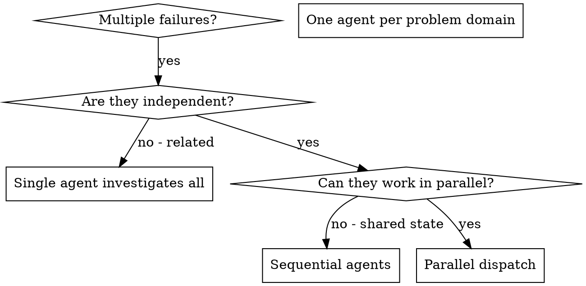

# Dispatching Parallel Agents

## Overview

委任務於特化 agent，孤立 context。精工其 instruction 與 context，使專注成事。勿令承汝 session 之歷史——汝構其所需。此亦保汝 context 於協調之務。

多失敗而無關（異測檔、異子系統、異 bug），序查耗時。每查獨立，可並行。

**核心原則：** 每獨立問題域派一 agent。使其並行。

## When to Use



**用於：**
- 3+ 測檔失敗而根因異
- 多子系統獨斷
- 每問題可獨解而無他 context
- 查間無共享 state

**不用於：**
- 失敗相關（修一或修他）
- 需知全系統 state
- Agent 互擾

## The Pattern

### 1. Identify Independent Domains

以所斷分失敗：
- File A tests: Tool approval flow
- File B tests: Batch completion behavior
- File C tests: Abort functionality

每域獨立——修 tool approval 不影 abort 測。

### 2. Create Focused Agent Tasks

每 agent 獲：
- **具體範圍：** 一測檔或子系統
- **明目標：** 使此等測過
- **限制：** 勿改他碼
- **期輸出：** 所見所修之摘要

### 3. Dispatch in Parallel

```typescript
// In Claude Code / AI environment
Task("Fix agent-tool-abort.test.ts failures")
Task("Fix batch-completion-behavior.test.ts failures")
Task("Fix tool-approval-race-conditions.test.ts failures")
// All three run concurrently
```

### 4. Review and Integrate

Agent 返時：
- 讀每摘要
- 驗修不衝
- 跑全測
- 整合所變

## Agent Prompt Structure

善 agent prompt：
1. **專注** - 一明問題域
2. **自足** - 解題所需之全 context
3. **具輸出期** - agent 當返何物？

```markdown
Fix the 3 failing tests in src/agents/agent-tool-abort.test.ts:

1. "should abort tool with partial output capture" - expects 'interrupted at' in message
2. "should handle mixed completed and aborted tools" - fast tool aborted instead of completed
3. "should properly track pendingToolCount" - expects 3 results but gets 0

These are timing/race condition issues. Your task:

1. Read the test file and understand what each test verifies
2. Identify root cause - timing issues or actual bugs?
3. Fix by:
   - Replacing arbitrary timeouts with event-based waiting
   - Fixing bugs in abort implementation if found
   - Adjusting test expectations if testing changed behavior

Do NOT just increase timeouts - find the real issue.

Return: Summary of what you found and what you fixed.
```

## Common Mistakes

**❌ 過廣：** "Fix all the tests" - agent 迷
**✅ 具體：** "Fix agent-tool-abort.test.ts" - 範圍明

**❌ 無 context：** "Fix the race condition" - agent 不知何處
**✅ 有 context：** 貼錯訊與測名

**❌ 無限制：** agent 或重構所有
**✅ 有限制：** "Do NOT change production code" 或 "Fix tests only"

**❌ 輸出模糊：** "Fix it" - 汝不知何變
**✅ 具體：** "Return summary of root cause and changes"

## When NOT to Use

**相關失敗：** 修一或修他——先合查
**需全 context：** 理解需見全系統
**探索性 debug：** 汝未知何斷
**共享 state：** agent 互擾（編同檔、用同資源）

## Real Example from Session

**情境：** 大重構後 3 檔 6 測失敗

**失敗：**
- agent-tool-abort.test.ts: 3 failures (timing issues)
- batch-completion-behavior.test.ts: 2 failures (tools not executing)
- tool-approval-race-conditions.test.ts: 1 failure (execution count = 0)

**決：** 域獨——abort 邏輯與 batch completion 與 race condition 分

**派：**
```
Agent 1 → Fix agent-tool-abort.test.ts
Agent 2 → Fix batch-completion-behavior.test.ts
Agent 3 → Fix tool-approval-race-conditions.test.ts
```

**果：**
- Agent 1: Replaced timeouts with event-based waiting
- Agent 2: Fixed event structure bug (threadId in wrong place)
- Agent 3: Added wait for async tool execution to complete

**整合：** 所修獨，無衝，全套綠

**省時：** 3 問並行 vs 序

## Key Benefits

1. **並行化** - 多查同時
2. **專注** - 每 agent 窄範圍，少 context 追
3. **獨立** - agent 不相擾
4. **速** - 3 問於 1 問之時

## Verification

Agent 返後：
1. **審每摘要** - 明所變
2. **察衝** - agent 編同碼否？
3. **跑全套** - 驗所修合作
4. **抽驗** - agent 或犯系統誤

## Real-World Impact

From debugging session (2025-10-03):
- 6 failures across 3 files
- 3 agents dispatched in parallel
- All investigations completed concurrently
- All fixes integrated successfully
- Zero conflicts between agent changes
