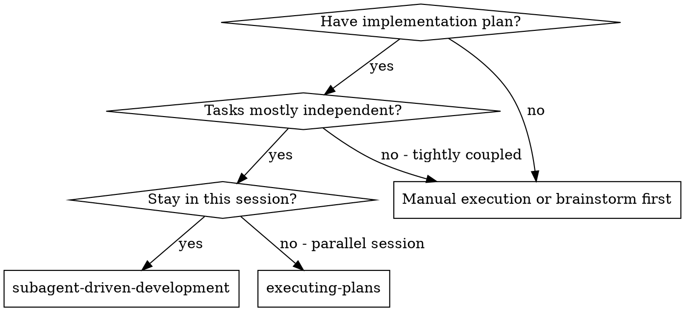
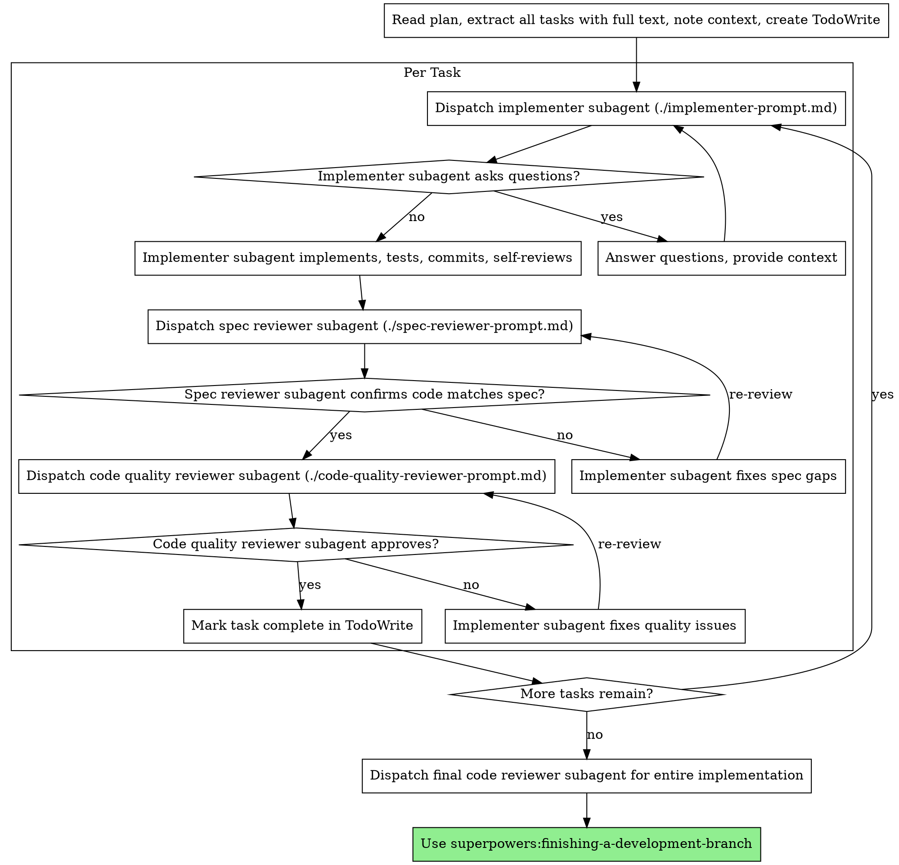

# Subagent-Driven Development

以新 subagent 逐任務執行計劃，每後二段審：先 spec 合規，後 code 質。

**何以用 subagent：** 委任務於特化 agent，孤立 context。精工其 instruction 與 context，使專注成事。勿令承汝 session 之歷史——汝構其所需。此亦保汝 context 於協調之務。

**核心原則：** 每任務一新 subagent + 二段審（spec 後質）= 高質、速代。

## When to Use



**vs. Executing Plans（並行 session）：**
- 同 session（無 context 切換）
- 每任務新 subagent（無 context 污染）
- 每任務後二段審：spec 合規先，後 code 質
- 速代（任務間無 human-in-loop）

## The Process



## Model Selection

用可勝任之最弱 model，以省成本增速。

**機械性實作任務**（孤立函式、明 spec、1-2 檔）：用快廉 model。大多實作任務於 plan 明時為機械。

**整合與判斷任務**（多檔協調、式匹配、debug）：用標準 model。

**架構、設計、審任務**：用最強 model。

**任務複雜度之兆：**
- 觸 1-2 檔、spec 全 → 廉 model
- 觸多檔、有整合關切 → 標準 model
- 需設計判斷或廣 codebase 理解 → 最強 model

## Handling Implementer Status

Implementer subagent 報四狀之一。各應其處置：

**DONE：** 進 spec 合規審。

**DONE_WITH_CONCERNS：** 竟工，然表疑。審前讀其疑。若疑關正確或範圍，先釋再審。若為觀察（例如「此檔漸大」），記之並進審。

**NEEDS_CONTEXT：** 缺訊。予缺之 context，重派。

**BLOCKED：** 不能成。評阻：
1. 若為 context 問題，予多 context，同 model 重派
2. 若任務需更多推理，以更強 model 重派
3. 若任務過大，拆之
4. 若計劃本身誤，升於 human

**勿** 忽升級或強同 model 無變重試。Implementer 言阻，必有須變。

## Prompt Templates

- `./implementer-prompt.md` - Dispatch implementer subagent
- `./spec-reviewer-prompt.md` - Dispatch spec compliance reviewer subagent
- `./code-quality-reviewer-prompt.md` - Dispatch code quality reviewer subagent

## Example Workflow

```
You: I'm using Subagent-Driven Development to execute this plan.

[Read plan file once: docs/superpowers/plans/feature-plan.md]
[Extract all 5 tasks with full text and context]
[Create TodoWrite with all tasks]

Task 1: Hook installation script

[Get Task 1 text and context (already extracted)]
[Dispatch implementation subagent with full task text + context]

Implementer: "Before I begin - should the hook be installed at user or system level?"

You: "User level (~/.config/superpowers/hooks/)"

Implementer: "Got it. Implementing now..."
[Later] Implementer:
  - Implemented install-hook command
  - Added tests, 5/5 passing
  - Self-review: Found I missed --force flag, added it
  - Committed

[Dispatch spec compliance reviewer]
Spec reviewer: ✅ Spec compliant - all requirements met, nothing extra

[Get git SHAs, dispatch code quality reviewer]
Code reviewer: Strengths: Good test coverage, clean. Issues: None. Approved.

[Mark Task 1 complete]

Task 2: Recovery modes

[Get Task 2 text and context (already extracted)]
[Dispatch implementation subagent with full task text + context]

Implementer: [No questions, proceeds]
Implementer:
  - Added verify/repair modes
  - 8/8 tests passing
  - Self-review: All good
  - Committed

[Dispatch spec compliance reviewer]
Spec reviewer: ❌ Issues:
  - Missing: Progress reporting (spec says "report every 100 items")
  - Extra: Added --json flag (not requested)

[Implementer fixes issues]
Implementer: Removed --json flag, added progress reporting

[Spec reviewer reviews again]
Spec reviewer: ✅ Spec compliant now

[Dispatch code quality reviewer]
Code reviewer: Strengths: Solid. Issues (Important): Magic number (100)

[Implementer fixes]
Implementer: Extracted PROGRESS_INTERVAL constant

[Code reviewer reviews again]
Code reviewer: ✅ Approved

[Mark Task 2 complete]

...

[After all tasks]
[Dispatch final code-reviewer]
Final reviewer: All requirements met, ready to merge

Done!
```

## Advantages

**vs. 手動執行：**
- Subagent 自然遵 TDD
- 每任務新 context（無混淆）
- 並行安全（subagent 不相擾）
- Subagent 可問（開工前與中）

**vs. Executing Plans：**
- 同 session（無交接）
- 續進（無待）
- 審 checkpoint 自動

**效率得：**
- 無讀檔 overhead（controller 予全文）
- Controller 精製所需 context
- Subagent 於開頭獲完全訊
- 疑於工前出，非工後

**質門：**
- Self-review 於交接前捉疾
- 二段審：spec 合規，後 code 質
- 審環確修有效
- Spec 合規防過建/欠建
- Code 質保實作完善

**成本：**
- Subagent 呼叫多（implementer + 2 reviewer per task）
- Controller 準備多（先抽所有任務）
- 審環加迭
- 然早捉疾（廉於日後 debug）

## Red Flags

**絕不：**
- 於 main/master 開工而無 user 明允
- 跳審（spec 合規或 code 質）
- 以未修之疾續進
- 並行派多 implementer subagent（衝突）
- 令 subagent 讀 plan 檔（予全文）
- 省背景脈絡（subagent 須知任務所屬）
- 忽 subagent 之疑（答後方令進）
- 於 spec 合規受「近可矣」（spec reviewer 見疾 = 未竟）
- 跳審環（reviewer 見疾 = implementer 修 = 再審）
- 令 implementer self-review 代真審（二者俱需）
- **於 spec 合規 ✅ 前開 code 質審**（順序誤）
- 審有未決而進次任務

**若 subagent 問：**
- 清答、完答
- 若需予更多 context
- 勿催之進實作

**若 reviewer 見疾：**
- Implementer（同 subagent）修之
- Reviewer 再審
- 重至許可
- 勿跳再審

**若 subagent 敗任：**
- 派修 subagent 並具指令
- 勿手修（context 污染）

## Integration

**所需 workflow skills：**
- **superpowers:using-git-worktrees** - 必需：先立孤立 workspace
- **superpowers:writing-plans** - 造此 skill 執行之計劃
- **superpowers:requesting-code-review** - 予 reviewer subagent 用之 code review template
- **superpowers:finishing-a-development-branch** - 所有任務畢後竟 development

**Subagent 當用：**
- **superpowers:test-driven-development** - Subagent 每任務遵 TDD

**替代 workflow：**
- **superpowers:executing-plans** - 用於並行 session 而非同 session 執行