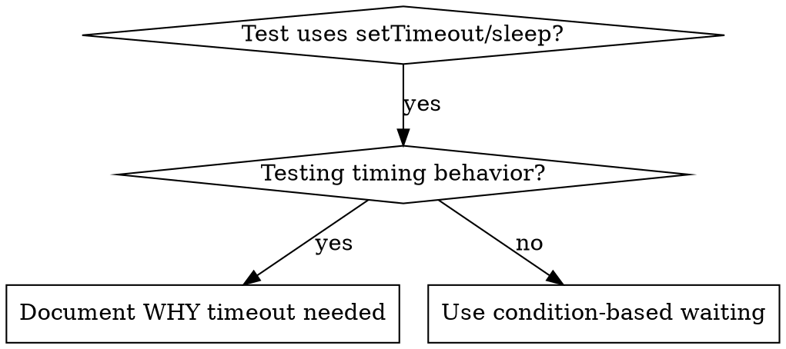

# Condition-Based Waiting

## Overview

Flaky tests 常以 arbitrary delay 臆测时机。乃生 race condition —— 快机则过，负载或 CI 则败。

**Core principle：** 候所关心之实状，非臆测所需之时。

## When to Use



**Use when：**
- Tests 含 arbitrary delay（`setTimeout`、`sleep`、`time.sleep()`）
- Tests flaky（时过时效）
- Tests 并行则 timeout
- 候 async operations 之完成

**Don't use when：**
- 测实 timing behavior（debounce、throttle intervals）
- 若用 arbitrary timeout，必 document 其因

## Core Pattern

```typescript
// ❌ BEFORE: Guessing at timing
await new Promise(r => setTimeout(r, 50));
const result = getResult();
expect(result).toBeDefined();

// ✅ AFTER: Waiting for condition
await waitFor(() => getResult() !== undefined);
const result = getResult();
expect(result).toBeDefined();
```

## Quick Patterns

| Scenario | Pattern |
|----------|---------|
| Wait for event | `waitFor(() => events.find(e => e.type === 'DONE'))` |
| Wait for state | `waitFor(() => machine.state === 'ready')` |
| Wait for count | `waitFor(() => items.length >= 5)` |
| Wait for file | `waitFor(() => fs.existsSync(path))` |
| Complex condition | `waitFor(() => obj.ready && obj.value > 10)` |

## Implementation

Generic polling function：
```typescript
async function waitFor<T>(
  condition: () => T | undefined | null | false,
  description: string,
  timeoutMs = 5000
): Promise<T> {
  const startTime = Date.now();

  while (true) {
    const result = condition();
    if (result) return result;

    if (Date.now() - startTime > timeoutMs) {
      throw new Error(`Timeout waiting for ${description} after ${timeoutMs}ms`);
    }

    await new Promise(r => setTimeout(r, 10)); // Poll every 10ms
  }
}
```

详见此目录 `condition-based-waiting-example.ts` —— 完整实现，附 domain-specific helpers（`waitForEvent`、`waitForEventCount`、`waitForEventMatch`），出自实调 session。

## Common Mistakes

**❌ Polling too fast：** `setTimeout(check, 1)` —— 耗 CPU
**✅ Fix：** Poll every 10ms

**❌ No timeout：** 若 condition 永不成，则 loop 无穷
**✅ Fix：** 必含 timeout，附 clear error

**❌ Stale data：** 於 loop 前 cache state
**✅ Fix：** 於 loop 内 call getter 以得 fresh data

## When Arbitrary Timeout IS Correct

```typescript
// Tool ticks every 100ms - need 2 ticks to verify partial output
await waitForEvent(manager, 'TOOL_STARTED'); // First: wait for condition
await new Promise(r => setTimeout(r, 200));   // Then: wait for timed behavior
// 200ms = 2 ticks at 100ms intervals - documented and justified
```

**Requirements：**
1. 先候 triggering condition
2. 基 known timing（非臆测）
3. Comment 释其因

## Real-World Impact

出自调试 session（2025-10-03）：
- 修复 15 flaky tests，跨 3 files
- Pass rate：60% → 100%
- Execution time：快 40%
- Race condition 不复见
