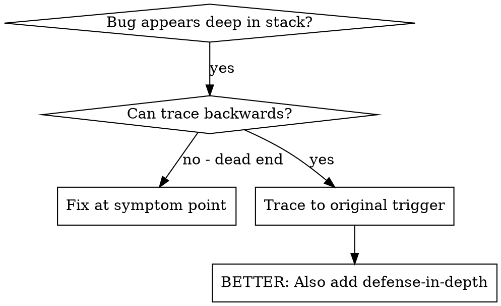
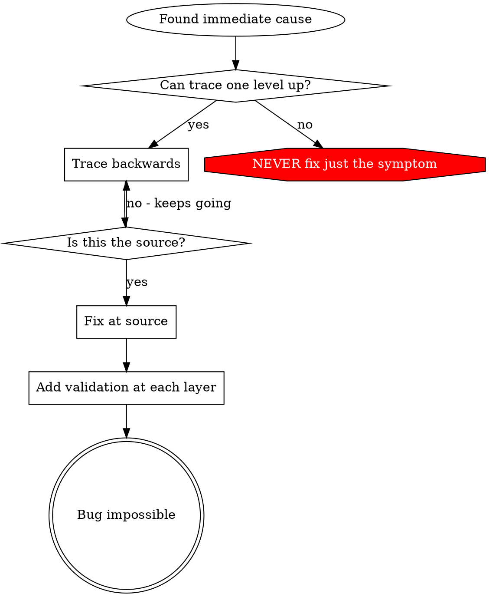

# Root Cause Tracing

## Overview

Bugs 常现於 call stack 深处（git init 於错 directory、file 创於错 location、database 以错 path 开启）。本能欲於 error 现处修复，然此乃治 symptom。

**Core principle：** 沿 call chain 逆向追溯，得 original trigger，乃於源修复。

## When to Use



**Use when：**
- Error 现於 execution 深处（非 entry point）
- Stack trace 示长 call chain
- Invalid data 之源未明
- 欲知何 test/code 触发此 problem

## The Tracing Process

### 1. Observe the Symptom
```
Error: git init failed in /Users/jesse/project/packages/core
```

### 2. Find Immediate Cause
**何 code 直接导致此？**
```typescript
await execFileAsync('git', ['init'], { cwd: projectDir });
```

### 3. Ask: What Called This?
```typescript
WorktreeManager.createSessionWorktree(projectDir, sessionId)
  → called by Session.initializeWorkspace()
  → called by Session.create()
  → called by test at Project.create()
```

### 4. Keep Tracing Up
**何 value 传入？**
- `projectDir = ''`（empty string！）
- Empty string 为 `cwd` 则解析为 `process.cwd()`
- 此乃 source code directory！

### 5. Find Original Trigger
**Empty string 起於何处？**
```typescript
const context = setupCoreTest(); // Returns { tempDir: '' }
Project.create('name', context.tempDir); // Accessed before beforeEach!
```

## Adding Stack Traces

不能手溯之时，添 instrumentation：

```typescript
// Before the problematic operation
async function gitInit(directory: string) {
  const stack = new Error().stack;
  console.error('DEBUG git init:', {
    directory,
    cwd: process.cwd(),
    nodeEnv: process.env.NODE_ENV,
    stack,
  });

  await execFileAsync('git', ['init'], { cwd: directory });
}
```

**Critical：** Tests 中用 `console.error()`（非 logger —— 或不见）

**Run and capture：**
```bash
npm test 2>&1 | grep 'DEBUG git init'
```

**Analyze stack traces：**
- 寻 test file 之名
- 得触发 call 之 line number
- 识 pattern（同 test？同 parameter？）

## Finding Which Test Causes Pollution

测试之际某物现，而不知何 test 所致：

用此目录 bisection script `find-polluter.sh`：

```bash
./find-polluter.sh '.git' 'src/**/*.test.ts'
```

逐一行 tests，止於首 polluter。详见 script 之 usage。

## Real Example: Empty projectDir

**Symptom：** `.git` 现於 `packages/core/`（source code）

**Trace chain：**
1. `git init` 行於 `process.cwd()` ← empty cwd parameter
2. WorktreeManager 以 empty projectDir 被召
3. Session.create() 传入 empty string
4. Test 於 beforeEach 前 access `context.tempDir`
5. setupCoreTest() 初返 `{ tempDir: '' }`

**Root cause：** Top-level variable initialization 访问 empty value

**Fix：** 使 tempDir 为 getter，若 beforeEach 前被访问则 throw

**Also added defense-in-depth：**
- Layer 1：Project.create() validate directory
- Layer 2：WorkspaceManager validate 非 empty
- Layer 3：NODE_ENV guard 拒 git init 出 tmpdir
- Layer 4：git init 前 log stack trace

## Key Principle



**NEVER fix just where error appears.** 逆溯以得 original trigger。

## Stack Trace Tips

**Tests 中：** 用 `console.error()` 非 logger —— logger 或被 suppress
**Operation 前：** 於危险 operation 前 log，非其败后
**Include context：** Directory、cwd、environment variables、timestamps
**Capture stack：** `new Error().stack` 示完整 call chain

## Real-World Impact

出自调试 session（2025-10-03）：
- 经五层 trace 得 root cause
- 於源修复（getter validation）
- 添四层 defense
- 1847 tests 过，零 pollution
