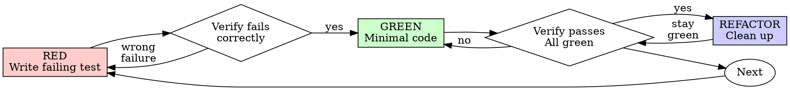

# Test-Driven Development (TDD)

## Overview

先寫測。觀其敗。後寫最簡碼以過。

**核心原則：** 未觀測敗，則不知其測真物否。

**違其字即違其意。**

## When to Use

**常：**
- 新功
- Bug 修
- 重構
- 行為變更

**例外（問 your human partner）：**
- 棄用 prototype
- 生成碼
- 配置檔

思「僅此一次跳 TDD」？ 止。此即託辭。

## The Iron Law

```
NO PRODUCTION CODE WITHOUT A FAILING TEST FIRST
```

測前寫碼？ 刪之。重起。

**無例外：**
- 勿留為「參考」
- 勿寫測時「改用」之
- 勿視之
- 刪即刪

從測重作。止。

## Red-Green-Refactor



### RED - Write Failing Test

寫一最小測示其應行之事。

<Good>
```typescript
test('retries failed operations 3 times', async () => {
  let attempts = 0;
  const operation = () => {
    attempts++;
    if (attempts < 3) throw new Error('fail');
    return 'success';
  };

  const result = await retryOperation(operation);

  expect(result).toBe('success');
  expect(attempts).toBe(3);
});
```
清名，測真行為，一物
</Good>

<Bad>
```typescript
test('retry works', async () => {
  const mock = jest.fn()
    .mockRejectedValueOnce(new Error())
    .mockRejectedValueOnce(new Error())
    .mockResolvedValueOnce('success');
  await retryOperation(mock);
  expect(mock).toHaveBeenCalledTimes(3);
});
```
模糊名，測 mock 非 code
</Bad>

**所需：**
- 一行為
- 清名
- 真碼（無 mock 除非不可避）

### Verify RED - Watch It Fail

**必行。勿跳。**

```bash
npm test path/to/test.test.ts
```

確：
- 測敗（非錯）
- 敗訊為所期
- 敗因功缺（非打字錯）

**測過？** 汝測既有行為。修測。

**測錯？** 修錯，再跑至正確敗。

### GREEN - Minimal Code

寫最簡碼以過測。

<Good>
```typescript
async function retryOperation<T>(fn: () => Promise<T>): Promise<T> {
  for (let i = 0; i < 3; i++) {
    try {
      return await fn();
    } catch (e) {
      if (i === 2) throw e;
    }
  }
  throw new Error('unreachable');
}
```
剛好過
</Good>

<Bad>
```typescript
async function retryOperation<T>(
  fn: () => Promise<T>,
  options?: {
    maxRetries?: number;
    backoff?: 'linear' | 'exponential';
    onRetry?: (attempt: number) => void;
  }
): Promise<T> {
  // YAGNI
}
```
過度工程
</Bad>

勿加功、勿重構他碼、勿超測「改良」。

### Verify GREEN - Watch It Pass

**必行。**

```bash
npm test path/to/test.test.ts
```

確：
- 測過
- 他測仍過
- 輸出潔（無錯、無警）

**測敗？** 修碼，非測。

**他測敗？** 立修。

### REFACTOR - Clean Up

綠後方可：
- 除重
- 正名
- 抽 helper

保測綠。勿加行為。

### Repeat

次功之次測敗。

## Good Tests

| Quality | Good | Bad |
|---------|------|-----|
| **Minimal** | 一物。名含「and」？ 拆之。 | `test('validates email and domain and whitespace')` |
| **Clear** | 名述行為 | `test('test1')` |
| **Shows intent** | 示期望 API | 晦其應行 |

## Why Order Matters

**「吾測後以驗碼效」**

碼後之測立即過。立即過無證：
- 或測誤物
- 或測實作非行為
- 或漏汝忘之邊界
- 汝從未觀測捕 bug

測先強汝觀測敗，證其真測某事。

**「吾已手測所有邊界」**

手測 ad-hoc。汝自以為全測，然：
- 無記汝所測
- 改碼不可重跑
- 壓下易忘
- 「吾試之能行」 ≠ 周全

自動測系統化。每次同樣執行。

**「刪 X 小時之工浪費」**

沉沒成本誤。時已逝。汝今之擇：
- 刪而以 TDD 重作（X 小時，高信）
- 留而後補測（30 min，低信，多生 bug）

「浪費」乃留不可信之碼。無真測之碼即技債。

**「TDD 教條，務實意調整」**

TDD 方為務實：
- commit 前捕 bug（速於日後 debug）
- 防回歸（測即捕斷）
- 錄行為（測示碼之用法）
- 助重構（自由改，測捕斷）

「務實」捷徑 = prod debug = 更慢。

**「測後得同目標——乃意不儀」**

非也。測後答「此作何事？」 測先答「此當作何事？」

測後偏於實作。汝測所建，非所需。汝驗記得之邊界，非探得之。

測先強邊界探於實作前。測後驗汝記得（汝未記得）。

30 分之測後 ≠ TDD。得 coverage，失測真作之證。

## Common Rationalizations

| Excuse | Reality |
|--------|---------|
| 「太簡無需測」 | 簡碼亦斷。測耗 30 秒。 |
| 「吾後測」 | 立即過之測無證。 |
| 「測後得同目標」 | 測後=「此作何事？」 測先=「此當作何事？」 |
| 「已手測」 | Ad-hoc ≠ 系統化。無記、不可重跑。 |
| 「刪 X 小時浪費」 | 沉沒成本誤。留不可信之碼即技債。 |
| 「留為參考，測先寫」 | 汝必改用。即測後。刪即刪。 |
| 「須先探」 | 可。棄探，以 TDD 始。 |
| 「難測 = 設計不明」 | 聽測。難測 = 難用。 |
| 「TDD 緩吾」 | TDD 速於 debug。務實即測先。 |
| 「手測快」 | 手測不證邊界。每改皆重測。 |
| 「既碼無測」 | 汝改之。為既碼加測。 |

## Red Flags - STOP and Start Over

- 測前有碼
- 實作後之測
- 測立即過
- 不能釋測何以敗
- 測「日後」加
- 託「僅此一次」
- 「吾已手測」
- 「測後得同目的」
- 「意不儀」
- 「留參考」或「改既碼」
- 「已耗 X 小時，刪浪費」
- 「TDD 教條，吾務實」
- 「此不同因為...」

**皆意：刪碼。以 TDD 重起。**

## Example: Bug Fix

**Bug：** 空 email 受

**RED**
```typescript
test('rejects empty email', async () => {
  const result = await submitForm({ email: '' });
  expect(result.error).toBe('Email required');
});
```

**Verify RED**
```bash
$ npm test
FAIL: expected 'Email required', got undefined
```

**GREEN**
```typescript
function submitForm(data: FormData) {
  if (!data.email?.trim()) {
    return { error: 'Email required' };
  }
  // ...
}
```

**Verify GREEN**
```bash
$ npm test
PASS
```

**REFACTOR**
若需，抽多欄 validation。

## Verification Checklist

標竟工前：

- [ ] 每新函/方有測
- [ ] 實作前觀每測敗
- [ ] 每測敗因所期（功缺，非打字錯）
- [ ] 寫最簡碼過每測
- [ ] 所有測過
- [ ] 輸出潔（無錯、無警）
- [ ] 測用真碼（mock 僅不可避時）
- [ ] 邊界與錯已涵

未能皆勾？ 汝跳 TDD。重起。

## When Stuck

| Problem | Solution |
|---------|----------|
| 不知如何測 | 寫願之 API。先寫 assertion。問 your human partner。 |
| 測過繁 | 設計過繁。簡其介面。 |
| 須 mock 所有 | 碼過耦。用 dependency injection。 |
| 測 setup 大 | 抽 helper。仍繁？ 簡設計。 |

## Debugging Integration

見 bug？ 寫失敗測以復之。遵 TDD 環。測證修並防回歸。

勿修 bug 無測。

## Testing Anti-Patterns

加 mock 或 test utility 時，讀 @testing-anti-patterns.md 以避常陷：
- 測 mock 行為非真行為
- 加 test-only 方於 prod 類
- 不解依賴而 mock

## Final Rule

```
Production code → test exists and failed first
Otherwise → not TDD
```

無 your human partner 之許則無例外。
