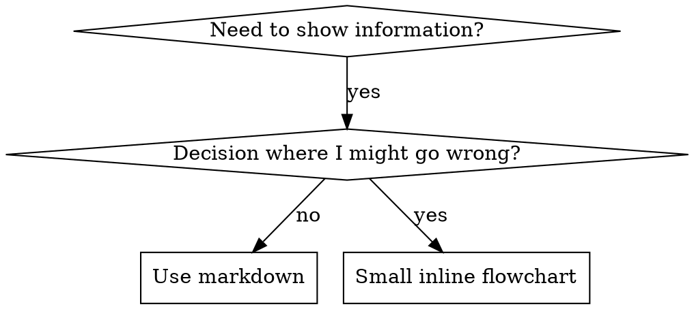

# Writing Skills

## Overview

**Writing skills IS Test-Driven Development applied to process documentation.**

**Personal skills live in agent-specific directories (`~/.claude/skills` for Claude Code, `~/.agents/skills/` for Codex)**

汝書測例（以 subagent 之壓力情境），觀其敗（baseline 行為），書 skill（文件），觀測過（agent 遵），重構（閉 loophole）。

**核心原則：** 未觀 agent 無 skill 而敗，則不知其 skill 教真事否。

**REQUIRED BACKGROUND：** 必先明 superpowers:test-driven-development。彼 skill 定 RED-GREEN-REFACTOR 之基環。此 skill 將 TDD 適於文件。

**Official guidance：** Anthropic 官之 skill authoring best practices 見 anthropic-best-practices.md。此補以式與指引，配本 skill 之 TDD 法。

## What is a Skill?

**skill** 乃已證技、式、工具之指南。助未來 Claude 尋且用有效法。

**Skills 為：** 可重用技、式、工具、指南

**Skills 非：** 汝某次解題之敘事

## TDD Mapping for Skills

| TDD Concept | Skill Creation |
|-------------|----------------|
| **Test case** | 以 subagent 之壓力情境 |
| **Production code** | Skill document (SKILL.md) |
| **Test fails (RED)** | Agent 無 skill 時違律（baseline） |
| **Test passes (GREEN)** | Agent 有 skill 則遵 |
| **Refactor** | 閉 loophole 而保遵 |
| **Write test first** | 書 skill 前跑 baseline 情境 |
| **Watch it fail** | 錄 agent 所用確切託辭 |
| **Minimal code** | 書 skill 針對此等違律 |
| **Watch it pass** | 驗 agent 今遵 |
| **Refactor cycle** | 尋新託辭 → 塞 → 再驗 |

整 skill 造程遵 RED-GREEN-REFACTOR。

## When to Create a Skill

**造於：**
- 技於汝非立明
- 汝跨 project 會再用
- 式廣適（非 project 特）
- 他人得益

**勿造於：**
- 一次性解
- 他處已錄之標準
- Project 特慣例（入 CLAUDE.md）
- 機械限（若可 regex/validation 強，自動化之——文件留判斷）

## Skill Types

### Technique
具體法有步（condition-based-waiting, root-cause-tracing）

### Pattern
思問之方（flatten-with-flags, test-invariants）

### Reference
API docs、syntax 指、工具文件（office docs）

## Directory Structure


```
skills/
  skill-name/
    SKILL.md              # Main reference (required)
    supporting-file.*     # Only if needed
```

**Flat namespace** - 所有 skill 在一可搜 namespace

**獨檔用於：**
1. **重參考**（100+ lines） - API docs、綜合 syntax
2. **可重用工具** - Script、utility、template

**保 inline：**
- 原則與概念
- Code pattern（< 50 lines）
- 其他

## SKILL.md Structure

**Frontmatter (YAML)：**
- 二必欄：`name` + `description`（見 [agentskills.io/specification](https://agentskills.io/specification) 其餘）
- 總共 1024 字符最多
- `name`：僅字母、數字、連字（無括號、特殊字）
- `description`：第三人稱，**僅**述何時用（**非**述何為）
  - 以 "Use when..." 起，專注觸發條件
  - 含具體症狀、情境、context
  - **絕不摘 skill 之 process 或 workflow**（見 CSO 節以明何以）
  - 若可，500 字以下

```markdown
---
name: Skill-Name-With-Hyphens
description: Use when [specific triggering conditions and symptoms]
---

# Skill Name

## Overview
What is this? Core principle in 1-2 sentences.

## When to Use
[Small inline flowchart IF decision non-obvious]

Bullet list with SYMPTOMS and use cases
When NOT to use

## Core Pattern (for techniques/patterns)
Before/after code comparison

## Quick Reference
Table or bullets for scanning common operations

## Implementation
Inline code for simple patterns
Link to file for heavy reference or reusable tools

## Common Mistakes
What goes wrong + fixes

## Real-World Impact (optional)
Concrete results
```


## Claude Search Optimization (CSO)

**發現之要：** 未來 Claude 須尋得汝 skill

### 1. Rich Description Field

**用意：** Claude 讀 description 以決所載 skill。令其答：「吾今當讀此 skill 否？」

**形：** 以 "Use when..." 起，專注觸發條件

**CRITICAL：Description = When to Use，非 What the Skill Does**

Description 僅述觸發條件。**勿** 摘 skill 之 process 或 workflow。

**何以重要：** 測揭：description 摘 workflow 時，Claude 或依 description 行而不讀 skill 全文。一 description 言 "code review between tasks" 致 Claude 僅作一審，雖 skill flowchart 明示二審。

Description 改為僅 "Use when executing implementation plans with independent tasks"（無 workflow 摘）後，Claude 正確讀 flowchart 並遵二段審。

**陷阱：** 摘 workflow 之 description 造 Claude 必取之捷徑。Skill body 成 Claude 跳之文件。

```yaml
# ❌ BAD: Summarizes workflow - Claude may follow this instead of reading skill
description: Use when executing plans - dispatches subagent per task with code review between tasks

# ❌ BAD: Too much process detail
description: Use for TDD - write test first, watch it fail, write minimal code, refactor

# ✅ GOOD: Just triggering conditions, no workflow summary
description: Use when executing implementation plans with independent tasks in the current session

# ✅ GOOD: Triggering conditions only
description: Use when implementing any feature or bugfix, before writing implementation code
```

**Content：**
- 用具體觸發、症狀、情境以示 skill 適用
- 述 *問題*（race condition、inconsistent behavior）非 *語言特症*（setTimeout、sleep）
- 觸發盡技術無關，除非 skill 本技術特
- 若 skill 技術特，於觸發中明之
- 書於第三人稱（注入 system prompt）
- **絕不摘 skill 之 process 或 workflow**

```yaml
# ❌ BAD: Too abstract, vague, doesn't include when to use
description: For async testing

# ❌ BAD: First person
description: I can help you with async tests when they're flaky

# ❌ BAD: Mentions technology but skill isn't specific to it
description: Use when tests use setTimeout/sleep and are flaky

# ✅ GOOD: Starts with "Use when", describes problem, no workflow
description: Use when tests have race conditions, timing dependencies, or pass/fail inconsistently

# ✅ GOOD: Technology-specific skill with explicit trigger
description: Use when using React Router and handling authentication redirects
```

### 2. Keyword Coverage

用 Claude 會搜之詞：
- 錯訊："Hook timed out"、"ENOTEMPTY"、"race condition"
- 症狀："flaky"、"hanging"、"zombie"、"pollution"
- 同義："timeout/hang/freeze"、"cleanup/teardown/afterEach"
- 工具：實令、library 名、檔型

### 3. Descriptive Naming

**用主動語、動詞先：**
- ✅ `creating-skills` 非 `skill-creation`
- ✅ `condition-based-waiting` 非 `async-test-helpers`

### 4. Token Efficiency (Critical)

**題：** getting-started 與常引 skill 載入每 conversation。每 token 皆值。

**字數目標：**
- getting-started workflow：<150 字 each
- 常載 skill：<200 字 total
- 他 skill：<500 字（仍簡）

**技：**

**移細節入 tool help：**
```bash
# ❌ BAD: Document all flags in SKILL.md
search-conversations supports --text, --both, --after DATE, --before DATE, --limit N

# ✅ GOOD: Reference --help
search-conversations supports multiple modes and filters. Run --help for details.
```

**用 cross-reference：**
```markdown
# ❌ BAD: Repeat workflow details
When searching, dispatch subagent with template...
[20 lines of repeated instructions]

# ✅ GOOD: Reference other skill
Always use subagents (50-100x context savings). REQUIRED: Use [other-skill-name] for workflow.
```

**壓縮例：**
```markdown
# ❌ BAD: Verbose example (42 words)
your human partner: "How did we handle authentication errors in React Router before?"
You: I'll search past conversations for React Router authentication patterns.
[Dispatch subagent with search query: "React Router authentication error handling 401"]

# ✅ GOOD: Minimal example (20 words)
Partner: "How did we handle auth errors in React Router?"
You: Searching...
[Dispatch subagent → synthesis]
```

**除冗：**
- 勿重 cross-reference 之 skill 內容
- 勿釋令之顯見
- 勿多例示同式

**驗：**
```bash
wc -w skills/path/SKILL.md
# getting-started workflows: aim for <150 each
# Other frequently-loaded: aim for <200 total
```

**按所作或核見名：**
- ✅ `condition-based-waiting` > `async-test-helpers`
- ✅ `using-skills` 非 `skill-usage`
- ✅ `flatten-with-flags` > `data-structure-refactoring`
- ✅ `root-cause-tracing` > `debugging-techniques`

**動名（-ing）合 process：**
- `creating-skills`、`testing-skills`、`debugging-with-logs`
- 主動，述汝所作

### 4. Cross-Referencing Other Skills

**書引他 skill 之文件時：**

僅用 skill 名，加明求記：
- ✅ Good：`**REQUIRED SUB-SKILL:** Use superpowers:test-driven-development`
- ✅ Good：`**REQUIRED BACKGROUND:** You MUST understand superpowers:systematic-debugging`
- ❌ Bad：`See skills/testing/test-driven-development`（不清須否）
- ❌ Bad：`@skills/testing/test-driven-development/SKILL.md`（強載，耗 context）

**何以無 @ links：** `@` syntax 立載檔，耗 200k+ context 於未需前。

## Flowchart Usage



**Flowchart 僅用於：**
- 非顯決點
- 或提前止之 process 迴
- "A vs B 何時用" 決

**絕不用於：**
- 參考資料 → 表、列
- Code 例 → Markdown block
- 線性指令 → 編號列
- 無語義之標（step1, helper2）

見 @graphviz-conventions.dot 以察 graphviz style。

**為 your human partner 視覺化：** 用本目錄之 `render-graphs.js` 將 skill flowchart 繪 SVG：
```bash
./render-graphs.js ../some-skill           # Each diagram separately
./render-graphs.js ../some-skill --combine # All diagrams in one SVG
```

## Code Examples

**一佳例勝多庸**

擇最適語：
- Testing techniques → TypeScript/JavaScript
- System debugging → Shell/Python
- Data processing → Python

**佳例：**
- 完整可跑
- 善注，釋 WHY
- 自真情境
- 明示式
- 備用（非 generic template）

**勿：**
- 五+ 語實作
- 造填空 template
- 書牽強例

汝善移植——一佳例足。

## File Organization

### Self-Contained Skill
```
defense-in-depth/
  SKILL.md    # Everything inline
```
當：內容全可 inline，無須重參考

### Skill with Reusable Tool
```
condition-based-waiting/
  SKILL.md    # Overview + patterns
  example.ts  # Working helpers to adapt
```
當：tool 為可重用碼，非僅敘事

### Skill with Heavy Reference
```
pptx/
  SKILL.md       # Overview + workflows
  pptxgenjs.md   # 600 lines API reference
  ooxml.md       # 500 lines XML structure
  scripts/       # Executable tools
```
當：參考料過大不可 inline

## The Iron Law (Same as TDD)

```
NO SKILL WITHOUT A FAILING TEST FIRST
```

適於新 skill 與既 skill 之 edit。

書 skill 前未測？ 刪之。重起。
改 skill 前未測？ 同違。

**無例外：**
- 非「簡加」
- 非「僅加節」
- 非「文件更」
- 勿留未測變為「參考」
- 勿於跑測時「改用」
- 刪即刪

**REQUIRED BACKGROUND：** superpowers:test-driven-development 釋何以重要。同原則適於文件。

## Testing All Skill Types

異 skill 型需異測法：

### Discipline-Enforcing Skills (rules/requirements)

**例：** TDD、verification-before-completion、designing-before-coding

**測以：**
- 學術問：明律否？
- 壓力情境：壓下遵否？
- 多壓合：time + sunk cost + exhaustion
- 辨託辭並加明抗

**成之準：** Agent 於極壓下遵律

### Technique Skills (how-to guides)

**例：** condition-based-waiting、root-cause-tracing、defensive-programming

**測以：**
- 應用情境：能正用技否？
- 變異情境：處邊界否？
- 缺訊測：指令有缺否？

**成之準：** Agent 於新情境成用技

### Pattern Skills (mental models)

**例：** reducing-complexity、information-hiding concepts

**測以：**
- 識別情境：識式之適用否？
- 應用情境：能用此心模否？
- 反例：知何時**勿**用否？

**成之準：** Agent 正辨何時/如何用式

### Reference Skills (documentation/APIs)

**例：** API 文件、令參考、library 指

**測以：**
- 取回情境：能尋正訊否？
- 應用情境：能正用所尋否？
- 缺測：常用涵蓋否？

**成之準：** Agent 尋且正用參考訊

## Common Rationalizations for Skipping Testing

| Excuse | Reality |
|--------|---------|
| 「Skill 明顯清」 | 於汝清 ≠ 於他 agent 清。測之。 |
| 「僅為參考」 | 參考亦有缺、模糊。測取回。 |
| 「測太過」 | 未測 skill 恆有疾。15 分測省數時。 |
| 「疾現則測」 | 疾 = agent 不能用。部署前測。 |
| 「測太煩」 | 測煩於日後 debug 壞 skill。 |
| 「吾信佳」 | 過信必生疾。仍測。 |
| 「學術審足」 | 讀 ≠ 用。測應用情境。 |
| 「無暇測」 | 部署未測省時少於日後修。 |

**皆意：部署前測。無例外。**

## Bulletproofing Skills Against Rationalization

強律之 skill（如 TDD）須抗託辭。Agent 智，壓下必尋 loophole。

**心理註：** 明說服技**何以**有效助汝系統化用之。見 persuasion-principles.md 以察研究基（Cialdini, 2021；Meincke et al., 2025）：authority、commitment、scarcity、social proof、unity。

### Close Every Loophole Explicitly

勿僅述律——明禁特解：

<Bad>
```markdown
Write code before test? Delete it.
```
</Bad>

<Good>
```markdown
Write code before test? Delete it. Start over.

**No exceptions:**
- Don't keep it as "reference"
- Don't "adapt" it while writing tests
- Don't look at it
- Delete means delete
```
</Good>

### Address "Spirit vs Letter" Arguments

早加根原：

```markdown
**Violating the letter of the rules is violating the spirit of the rules.**
```

此斷「吾遵其意」類託辭。

### Build Rationalization Table

自 baseline 測捕託辭（見下 Testing 節）。所有託辭入表：

```markdown
| Excuse | Reality |
|--------|---------|
| "Too simple to test" | Simple code breaks. Test takes 30 seconds. |
| "I'll test after" | Tests passing immediately prove nothing. |
| "Tests after achieve same goals" | Tests-after = "what does this do?" Tests-first = "what should this do?" |
```

### Create Red Flags List

令 agent 易自察託辭：

```markdown
## Red Flags - STOP and Start Over

- Code before test
- "I already manually tested it"
- "Tests after achieve the same purpose"
- "It's about spirit not ritual"
- "This is different because..."

**All of these mean: Delete code. Start over with TDD.**
```

### Update CSO for Violation Symptoms

加於 description：將違律之症狀：

```yaml
description: use when implementing any feature or bugfix, before writing implementation code
```

## RED-GREEN-REFACTOR for Skills

遵 TDD 環：

### RED: Write Failing Test (Baseline)

以 subagent 跑壓力情境**無** skill。錄確切行為：
- 何擇？
- 何託辭（逐字）？
- 何壓觸違律？

此即「觀測敗」——書 skill 前必先見 agent 之自然行為。

### GREEN: Write Minimal Skill

書 skill 針對彼等託辭。勿為假設情況加多餘。

同情境加 skill 再跑。Agent 今應遵。

### REFACTOR: Close Loopholes

Agent 尋新託辭？ 加明抗。再測至不可破。

**Testing methodology：** 見 @testing-skills-with-subagents.md 以察完整測法：
- 如何書壓力情境
- 壓型（time、sunk cost、authority、exhaustion）
- 系統塞孔
- Meta-testing 技

## Anti-Patterns

### ❌ Narrative Example
"In session 2025-10-03, we found empty projectDir caused..."
**何以壞：** 過特，不可重用

### ❌ Multi-Language Dilution
example-js.js, example-py.py, example-go.go
**何以壞：** 品庸，維護負

### ❌ Code in Flowcharts
```dot
step1 [label="import fs"];
step2 [label="read file"];
```
**何以壞：** 不可 copy-paste、難讀

### ❌ Generic Labels
helper1, helper2, step3, pattern4
**何以壞：** Label 應有語義

## STOP: Before Moving to Next Skill

**書任 skill 後，必止並竟部署程。**

**勿：**
- 批造多 skill 而每不測
- 於當前未驗即進次
- 因「批更效」而跳測

**下部署 checklist 每 skill 必行。**

部署未測 skill = 部署未測碼。違質準。

## Skill Creation Checklist (TDD Adapted)

**IMPORTANT：用 TodoWrite 為下每 checklist 項立 todo。**

**RED Phase - Write Failing Test:**
- [ ] 造壓力情境（discipline skill 須 3+ 合壓）
- [ ] **無** skill 跑之——逐字錄 baseline
- [ ] 辨託辭/敗式

**GREEN Phase - Write Minimal Skill:**
- [ ] Name 僅字母、數字、連字（無括號/特殊字）
- [ ] YAML frontmatter 含必欄 `name` + `description`（最多 1024；見 [spec](https://agentskills.io/specification)）
- [ ] Description 以 "Use when..." 起並含具體觸發/症狀
- [ ] Description 第三人稱
- [ ] 全文含搜關鍵詞（錯、症、工具）
- [ ] Overview 明核原則
- [ ] 針對 RED 所辨之 baseline 敗
- [ ] Code inline 或連獨檔
- [ ] 一佳例（非多語）
- [ ] **有** skill 跑情境——驗 agent 今遵

**REFACTOR Phase - Close Loopholes:**
- [ ] 辨測中**新**託辭
- [ ] 加明抗（若為 discipline skill）
- [ ] 建所有迭之託辭表
- [ ] 立 red flags 列
- [ ] 再測至不可破

**Quality Checks:**
- [ ] 小 flowchart 僅於決非顯時
- [ ] Quick reference 表
- [ ] Common mistakes 節
- [ ] 無敘事
- [ ] 支檔僅為 tool 或重參考

**Deployment:**
- [ ] Commit skill 入 git 並 push 至汝 fork（若配）
- [ ] 若廣用，考經 PR 貢獻

## Discovery Workflow

未來 Claude 如何尋汝 skill：

1. **遇題**（"tests are flaky"）
3. **尋 SKILL**（description 配）
4. **略 overview**（關否？）
5. **讀式**（quick reference 表）
6. **載例**（僅於實作時）

**為此流優化** - 搜詞早且常。

## The Bottom Line

**Creating skills IS TDD for process documentation.**

同 Iron Law：未測無 skill。
同環：RED（baseline）→ GREEN（書 skill）→ REFACTOR（閉 loophole）。
同益：品佳、驚少、果堅。

若汝於碼遵 TDD，亦於 skill 遵之。同律適於文件。
